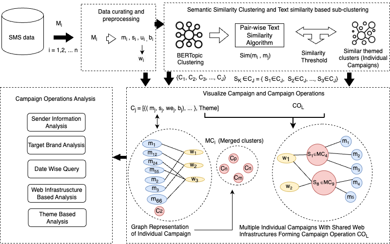
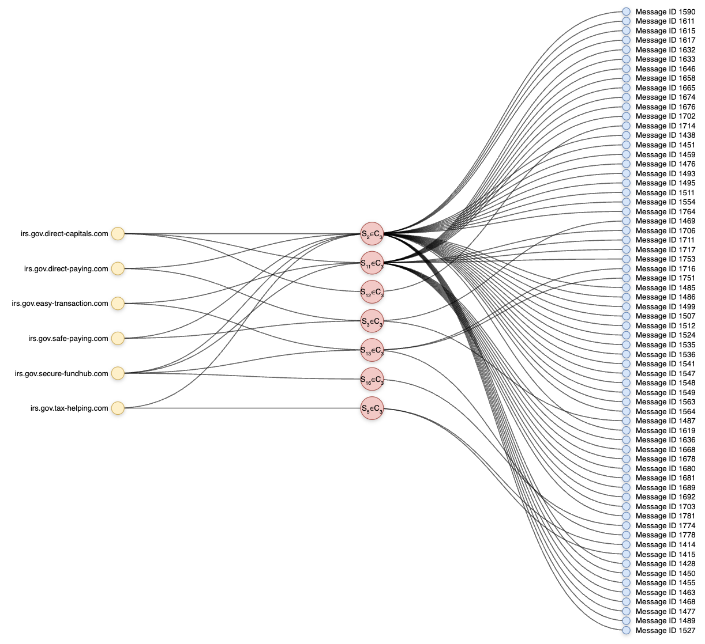
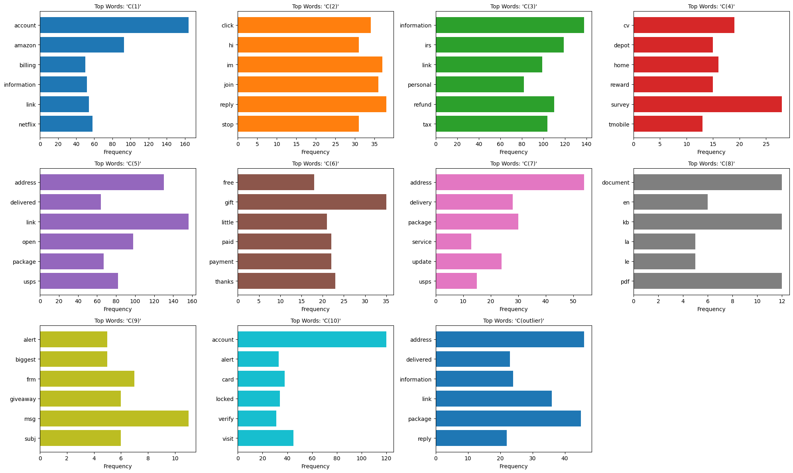

# SmishViz-Project
Official Repository of SmishViz Project


# SmishViz (CODASPY 2025 Paper Companion)

**SmishViz: A Graph-based Visualization System for Monitoring and Characterizing Ongoing Smishing Threats**

This repository provides supporting materials, analysis code, and figures accompanying our paper accepted at:

**The 15th ACM Conference on Data and Application Security and Privacy (CODASPY 2025)**

---

## Paper Summary

**SmishViz** presents a system that reveals smishing campaigns by clustering SMS messages and linking them via shared features (e.g., domain infrastructure, message keywords). This repository reproduces key analyses and figures from the paper, including infrastructure overlap, keyword patterns, and campaign graphs.

---

##  Repository Contents

| File/Folder | Description |
|-------------|-------------|
| `smishviz_topic.ipynb` | Preprocessing, data cleaning, and topic clustering of smishing messages |
| `keyword_frequencies.ipynb` | Analysis of keyword distribution within clusters and campaign themes |
| `domains_statics.ipynb` | Statistics on domains, and web infrastructure usage |
| `graph_generator.ipynb` | Generates JSON graph representations of smishing campaigns |
| `data/` (optional) | Contains a copy of the SmishTank dataset used in our analysis |

---


### Figure 1: SmishViz Architecture Overview

This figure presents the overall architecture of the SmishViz system. It illustrates the end-to-end pipeline starting from raw SMS messages, followed by preprocessing and topic clustering, infrastructure, and final campaign-level visualization. The architecture is designed to support both semantic and structural analysis of smishing threats.



### Figure 2: Campaign Graph Visualization

This figure visualizes a smishing campaign structured around a three-tier graph:

Yellow nodes (left) represent malicious URLs used in messages.

Red nodes (center) represent sub-clusters (Sₓ ∈ Cᵧ), where each sub-cluster is part of a larger BERTopic-derived cluster. These sub-clusters are formed using Ratcliff similarity.

Blue nodes (right) represent individual SMS messages.

Edges illustrate linkage across the tiers: each message is connected to a sub-cluster based on text similarity, and each sub-cluster is connected to one or more shared URLs. This structure reveals how different messages, though varied in wording, participate in coordinated campaigns using overlapping infrastructure and lexical patterns.



### Figure 3: Cluster Keyword Distributions

This chart shows the distribution of high-frequency keywords within a specific cluster of smishing messages. 




### How to Use

1. Clone this repository:
    ```bash
    git clone https://github.com/varnicm/SmishViz-Project.git
    cd smishviz-project
    ```

2. (Optional) Set up a virtual environment:
    ```bash
    python -m venv env
    source env/bin/activate
    ```

3. Launch the notebooks:
    ```bash
    jupyter notebook
    ```

> All notebooks are self-contained and annotated with outputs for reproducibility.

---

## Dataset

We use the [**SmishTank**]dataset (publicly available), which includes labeled smishing SMS messages.

---

## Citation

Please cite our paper if you use any part of this analysis:
    ```
@inproceedings{Sanjari2025SmishViz,
  author    = {Seyed Mohammad Sanjari et al.},
  title     = {SmishViz: Graph-based Visualization of Ongoing Smishing Threats},
  booktitle = {Proc. 15th ACM CODASPY},
  pages     = {257--268},
  year      = {2025},
  doi       = {10.1145/3714393.3726499}
}
    ```
